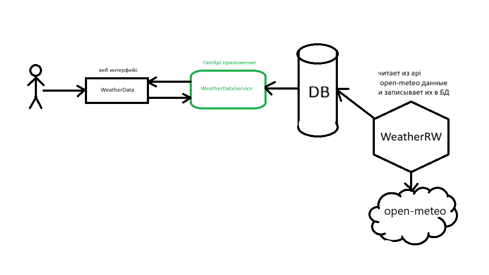

# start app
### clone rep
```bash
git clone https://github.com/krutoiChel2004/WEATHER.git
```

### create .env file
в папке с проектом создай .env file
1. **.env:**

    ```bash
    # connect DB
    DB_USER=postgres
    DB_PASS=2004
    DB_HOST=db
    DB_PORT=5432
    DB_NAME=weather_db
    ```

### run app

1. **start docker-compose**
    ```bash
    docker-compose up -d
    ```
    после запуска сервис будет доступен по это ссылке
    
    http://localhost:3000/

    


2. **check the operation status of the container**
    ```bash
    docker-compose ps
    ```


## application architecture

Принял решение разделить логику сбора/записи данных в БД и получения данных на два разных микросервиса, так же добавил веб интерфейс где можно выбрать промежуток времени за который вы хотите получить данные.

посторался каждое приложение сделать с луковой архитектурой.

из за того что open-meteo обновляет данные раз в 15 минут данные в xlsx файле повторяются




